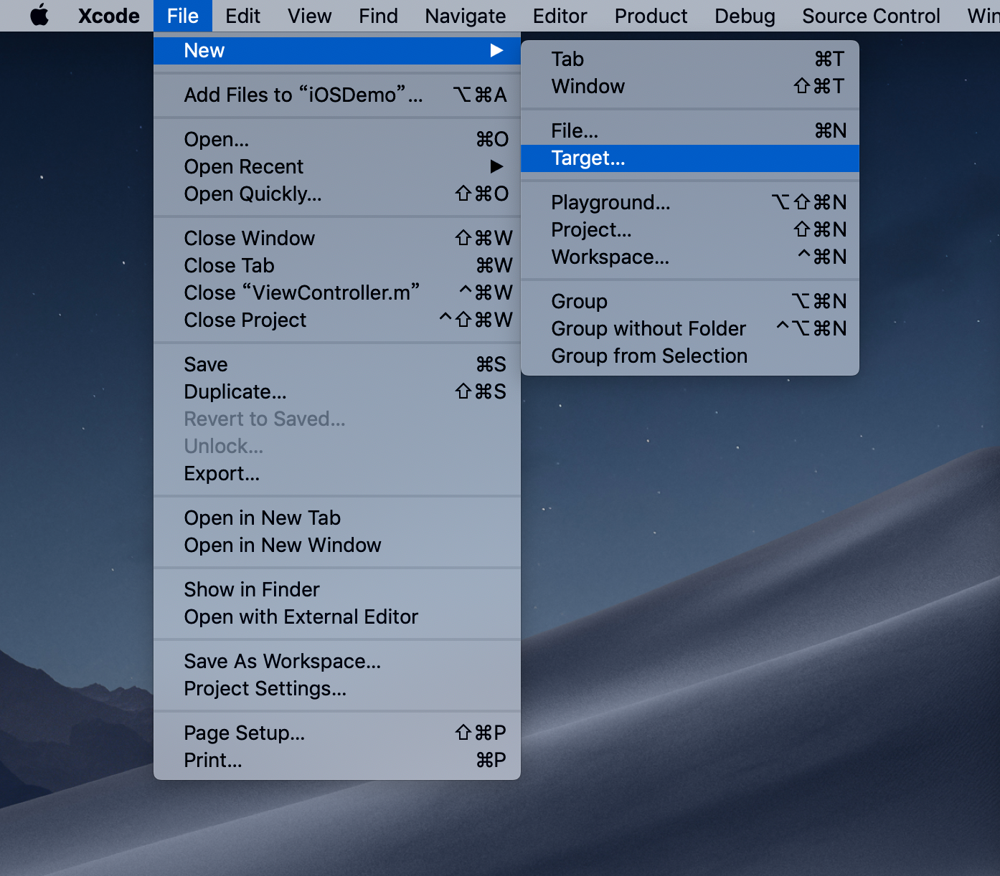
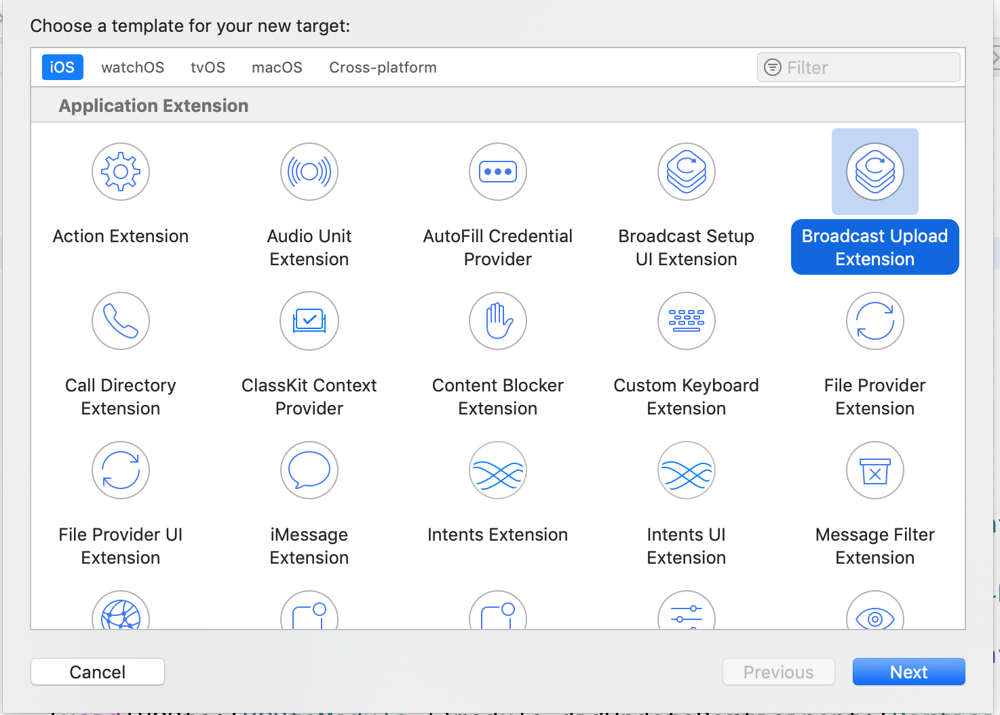
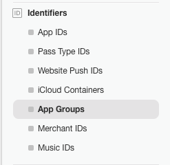
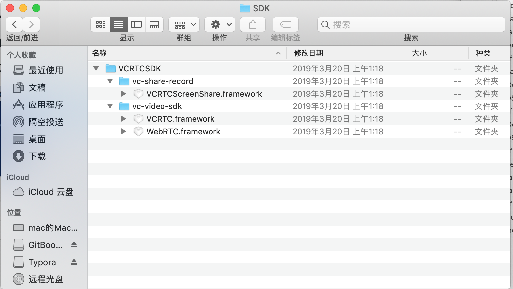
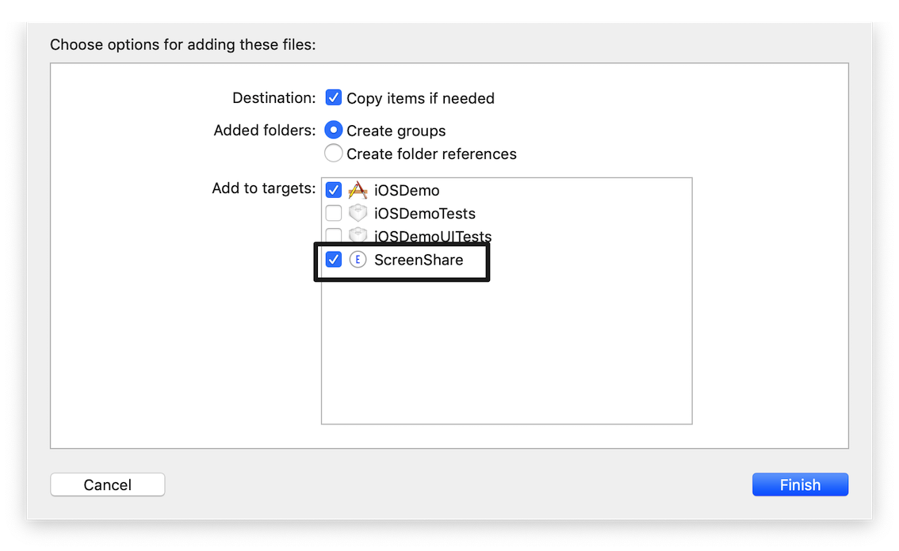
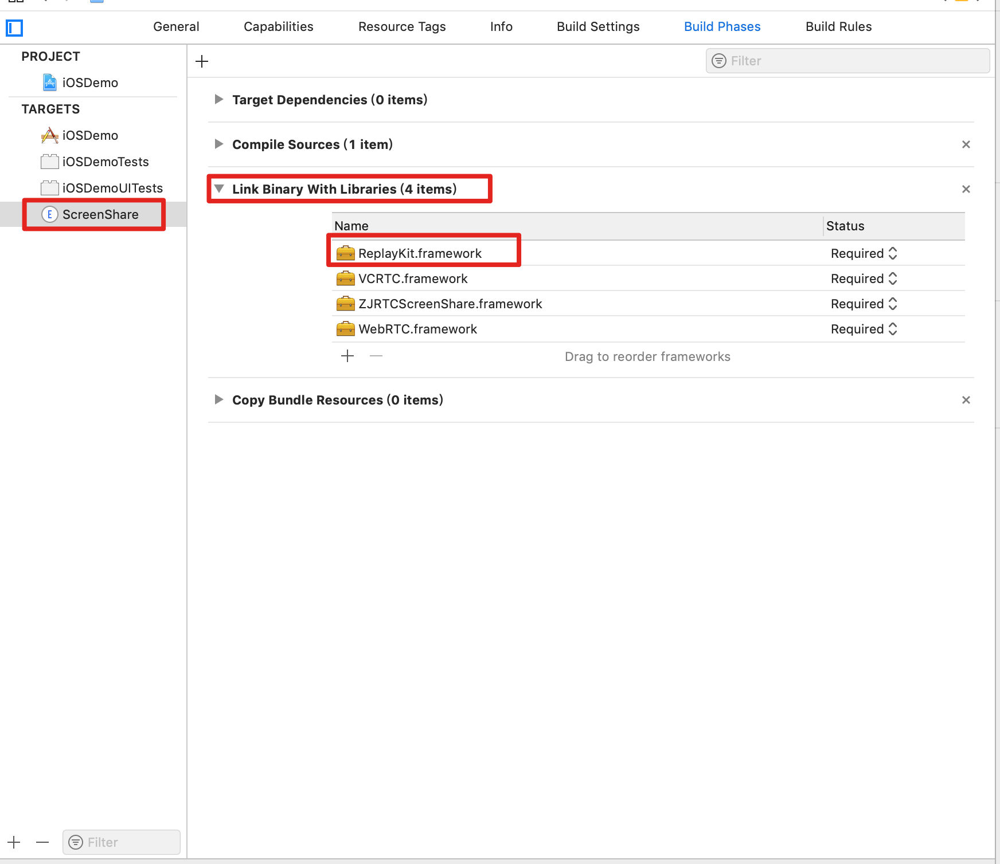
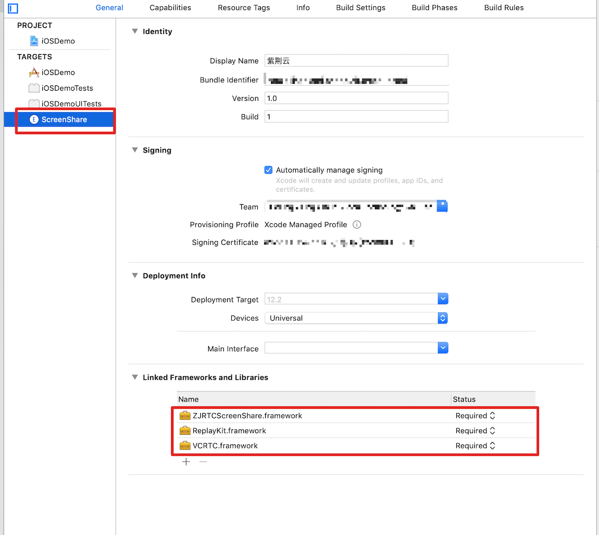
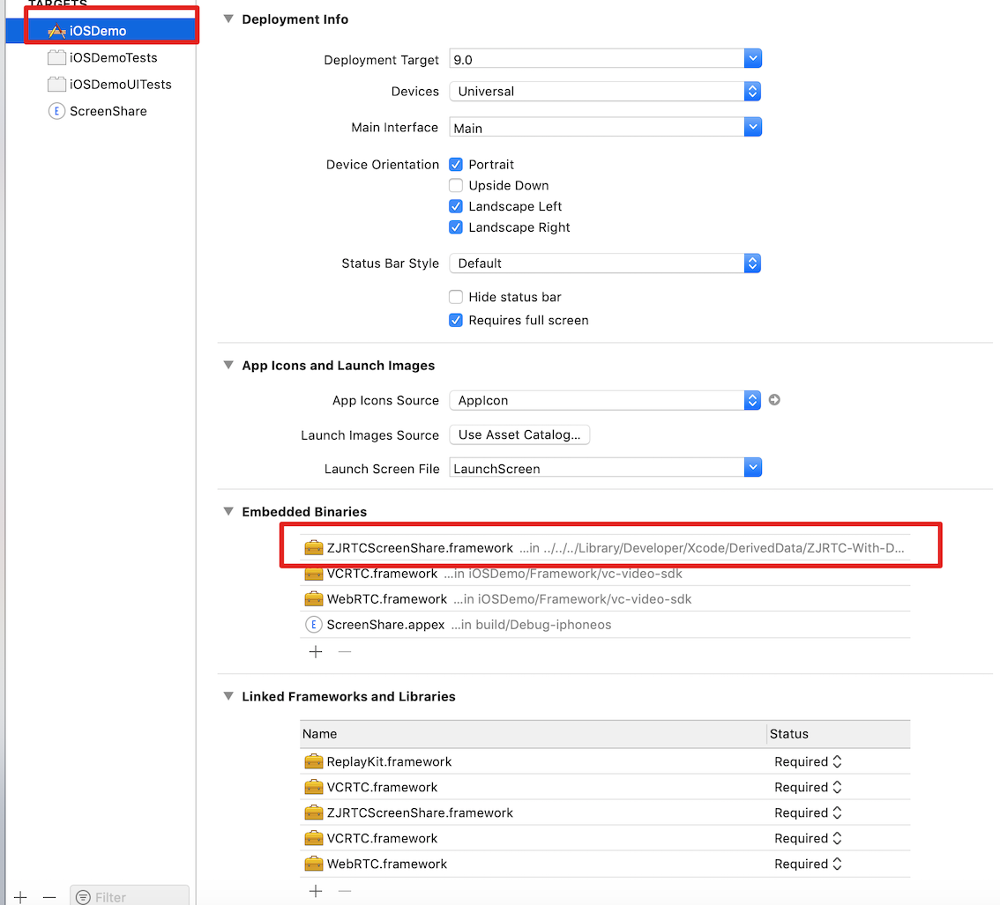
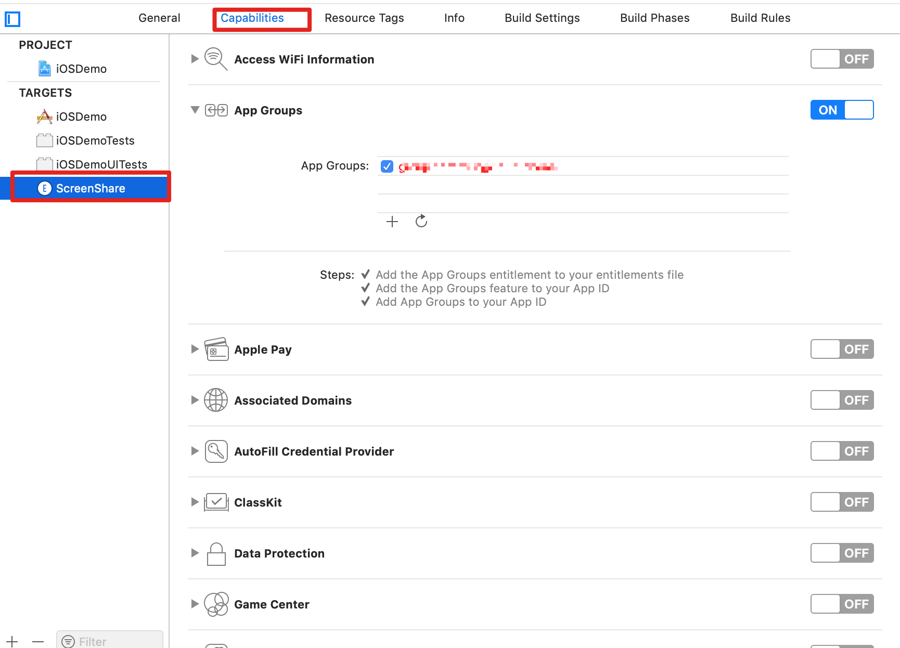

使用屏幕录制分享，随时随地分享您的屏幕到会议中

### 前提条件

- `iOS 11.0+`

### 集成步骤

1. 新建Application Extension

选中Xcode -> File -> New -> Target -> Broadcast Upload Extension (**注意: 新建时不要勾选Include UI Extension`**)






**新建后会创建 `SampleHandler.h` 和 `SampleHandler.m`两个文件**


2. 在 apple developer 中创建 相应的group id，并在Xcode中App 和 Extension打开App Groups



3. 把`VCRTCScreenShare.framework`拖入项目中





**注意:第一步新建的`Broadcast Upload Extension`这个项目要勾选上**

**在Link Binary with Libraries 中添加 `ReplayKit.framework`**








**添加App Groups**

`tagets`->`Capabilities`->`AppGroups`状态为ON 




```红色
注意: 
Group Identifier 由苹果开发者提供,具体请查看官方文档。  
Group Identifier 主要在主程序和扩展程序交互数据时使用,所以使用SDK中提供的“会中屏幕录制”服务,  
为主程序和拓展程序的 Bundle Identifier 绑定同一个 Group Identifier 至关重要。
```

##### 代码示例

在`SampleHandler.m`中引用 `VCRTCScreenShare.framework`

```objc
#import <VCRTCScreenShare/VCRTCScreenShare.h>
```

```objc
@property (nonatomic, strong) ScreenHelper *screenHelper;
//存储屏幕录制状态
@property (nonatomic, strong) NSUserDefaults *userDefault;

```

```objc
- (void)broadcastStartedWithSetupInfo:(NSDictionary<NSString *,NSObject *> *)setupInfo {
    self.screenHelper = [ScreenHelper sharedInstance];
    //1.配置GroupId
    self.screenHelper.groupId = kGroupId ;
    self.userDefault = [[NSUserDefaults alloc]initWithSuiteName:self.screenHelper.groupId];
    //开始录制屏幕,保存当前录制状态
    [self.userDefault setObject:@"start" forKey:kScreenRecordState];
    //2. 链接到分享
    [self.screenHelper connect];
}

//停止录制屏幕
- (void)broadcastFinished {
    //停止录制 保存当前停止录制状态
    [self.userDefault setObject:@"stop" forKey:kScreenRecordState];
}
```

```objc
- (void)stopRecordScreenTitle:(NSString *)errorReason{
    //录制出错,停止录制
    [self.userDefault setObject:@"stop" forKey:kScreenRecordState];
    [self.userDefault synchronize];
    
    NSDictionary *userInfo1 = [NSDictionary dictionaryWithObjectsAndKeys:@"", NSLocalizedDescriptionKey, errorReason, NSLocalizedFailureReasonErrorKey, @"",NSLocalizedRecoverySuggestionErrorKey,nil];
    NSError *error = [NSError errorWithDomain:@"" code:200 userInfo:userInfo1];
    //停止录制操作
    [self finishBroadcastWithError:error];
}


- (void)processSampleBuffer:(CMSampleBufferRef)sampleBuffer withType:(RPSampleBufferType)sampleBufferType {
    //屏幕录制状态
    NSString *openStates = [self.userDefault objectForKey:kScreenRecordState];
    //会议状态
    NSString *meetingStates = [self.userDefault objectForKey:kScreenRecordMeetingState];
    if ([meetingStates isEqualToString:@"outmeeting"]) {
    }
    if ([openStates isEqualToString:@"appfinsh"]) {
        [self stopRecordScreenTitle:@"您退出了应用，屏幕录制自动断开。"];
    }
    if ([openStates isEqualToString:@"appstop"]) {
        [self stopRecordScreenTitle:@"您停止了屏幕录制。"];
    }
    
    if ([openStates isEqualToString:@"stop"]) {
        [self stopRecordScreenTitle:@"其他参会者正在分享，您被中断。"];
    }
    switch (sampleBufferType) {
        case RPSampleBufferTypeVideo:
            // Handle video sample buffer
            //3.更新录制屏幕的数据流
            [self.screenHelper didCaptureSampleBuffer:sampleBuffer];
            break;
        case RPSampleBufferTypeAudioApp:
            // Handle audio sample buffer for app audio
            break;
        case RPSampleBufferTypeAudioMic:
            // Handle audio sample buffer for mic audio
            break;
            
        default:
            break;
    }
}
```

#### 
