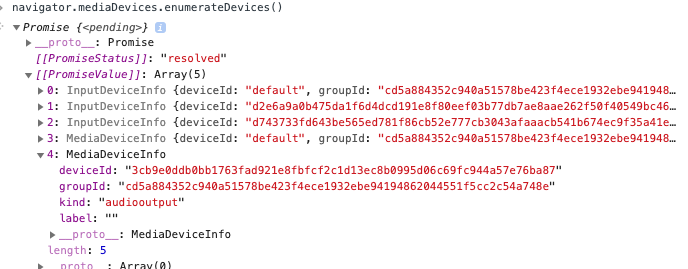

# SDK开发指南
这是云会中管理和Web入会的JavaScript API文档。基于Web的第三方应用程序可通过这个API对云平台上正在召开的会议或讲堂进行外呼、踢人、静音、锁会、Layout、录播等灵活的会中管理，也可以通过API 实现基于WebRTC的音视频通讯和屏幕/应用/文档等的共享。整个API包含客户端控制、会议控制、回调函数等三大部分，所有API都是通过一个称为“RTC”的对象访问的。

```
	var rtc = new ZjRTC();
```

## 音视频呼叫
### 加入会议：makeCall(node,conference,name,bandwidth,call_type)
​		加入会议，将通过WebRTC方式加入视频会议，呼叫成功将触发OnSetup回调函数。

主要参数


| node       									| 会议服务器的主机名或IP地址,<br/>请调用apiServer/api/v3/meet/checkJoin.shtml获取，参见《会中管理文档API》 |
| ------------------------------------------- | --------- |
| <a>conference</a> | 会议室地址或短号     |
| <a>name</a>       | 会议中显示的本人名字         |
| <a>bandwidth</a>  | 上下行带宽，可以为空(null)                                   |
| <a>call_type</a>  | 呼叫类型 可选  默认通过WebRTC 进行视频呼叫                   |
|            | “presentation” —只接收演示（辅流）的WebRTC呼叫               |
|            | “screen” — 只屏幕共享的WebRTC 呼叫                           |
|            | “audioonly” — 纯音频 WebRTC 呼叫                             |
|            | “recvonly” — 只收不发的 WebRTC 呼叫                          |

返回值

​		无。成功将触发onSetup 回调函数。需要执行完成会议链接命令connect(pin, extension)；

### 完成会议连接命令：connect(pin, extension)

​		用于完成连接的初始化处理。在通过onSetup回调函数获取初始信息后，必须调用该函数。如果会议室设置了密码保护，PIN这个会议密码参数不能为空（（如果入会密码不正确，onSetup将被再次调用）。

主要参数

| pin       | 入会密码。如果会议室没有设置入会密码，参数为null |
| --------- | ------------------------------------------------ |
| <a>extension</a> | 如直拨的会议室，该参数应为null                   |

返回值

​		无。 执行成功将触发onConnect回调函数；如果提供的入会密码不正确，将再次触发onSetup回调函数。

## 开关本地摄像头

### 设置命令：muteVideo(setting)

对本地摄像头执行关闭或打开的操作。rtc.mutedVideo = false; 开启本地摄像头

主要参数

| 参数    | 含义                                      |
| ------- | ----------------------------------------- |
| <a>setting</a> | true:关闭本地摄像头  false:开启本地摄像头 |

返回值

​	更新 rtc.mutedVideo 状态为 true。

## 开关本地麦克风

### 设置命令：muteAudio(setting)

对本地麦克风执行关闭或打开的操作。rtc.mutedAudio = false; 开启本地摄像头

主要参数

| 参数    | 含义                                      |
| ------- | ----------------------------------------- |
| <a>setting </a>| true:关闭本地麦克风  false:开启本地麦克风 |

返回值

​	更新 rtc.mutedAudio 状态为 true。

## 切换本地麦克风

### 设置变量：rtc.audio_source

通过传入不同的audio_source来切换麦克风

### audio_source获取方法

基于chrome浏览器端通过navigator.mediaDevices.enumerateDevices()方法获取到媒体设备相应指定麦克风的deviceId再赋值给audio_source

> navigator.mediaDevices.enumerateDevices() 
>
> 参考地址：https://developer.mozilla.org/zh-CN/docs/Web/API/MediaDevices/enumerateDevices



## 切换本地摄像头

#### 设置变量：rtc.video_source

通过传入不同的video_source来切换麦克风

### video_source获取方法

基于chrome浏览器端通过navigator.mediaDevices.enumerateDevices()方法获取到媒体设备相应指定麦克风的deviceId再赋值给video_source

> navigator.mediaDevices.enumerateDevices() 
>
> 参考地址：https://developer.mozilla.org/zh-CN/docs/Web/API/MediaDevices/enumerateDevices


## 添加音视频/演示信道：addCall(call_type)

添加视频、演示或屏幕共享至现有会议中。添加视频一般在当前rtc.call_type为none时调用()。

主要参数

| 参数      | 描述                                           |
| --------- | ---------------------------------------------- |
| <a>call_type</a> | “presentation” —只接收演示（辅流）的WebRTC呼叫 |
|           | “screen” — 只屏幕共享的WebRTC 呼叫             |
|           | “audioonly” — 纯音频 WebRTC 呼叫               |
|           | “recvonly” — 只收不发的 WebRTC 呼叫            |

## 会议控制

### 群发文字聊天信息：sendChatMessage(message)

向会议中的所有参会者发送文字聊天消息(只适用于WebRTC)

主要参数

| 参数    | 含义           |
| ------- | -------------- |
| <a>message </a>| 发送的文字信息 |

返回值


### 离开会议室:disconnect(referral);

断开与云平台的连接，离开会议室

| 参数     | 含义                                 |
| -------- | ------------------------------------ |
| <a>referral </a>| true 不清除辅流；false/none 清除辅流 |

返回值

无

### 开始/停止屏幕共享：present(call_type)

开始/停止屏幕共享（chrome73以上 或者 firefox 自带屏幕共享，无需安装插件；其余浏览器需要安装插件）

| 参数      | 含义                                  |
| --------- | ------------------------------------- |
| <a>call_type</a> | “screen”:开始屏幕共享；null：停止共享 |

返回值

无

### 获取媒体流统计信息：getMediaStatistics()

用于获取媒体流的统计信息。此方法只有Chrome浏览器支持。

主要参数

无

返回值

```
// 高清模式
{
	41a78781-0947-4da7-89b9-44581f91772a: {
		videoIn: {
			bitrate: 925,
			codec: "H264",
			decode-delay: "1ms",
			frameRate: "24",
			packets-lost: "1",
			packets-received: "18249",
			percentage-lost: 0,
			percentage-lost-recent: "0.0%",
			resolution: "960x540"
		}
	},
	c47b41a1-f245-4c20-aaba-a9139c32c17d: {
		audioIn: {
			bitrate: 69,
			codec: "opus",
			packets-lost: "0",
			packets-received: "10469",
			percentage-lost: 0,
			percentage-lost-recent: "0.0%"
		},
		audioOut: {
			bitrate: 69,
			codec: "opus",
			packets-lost: "0",
			packets-received: "10469",
			percentage-lost: 0,
			percentage-lost-recent: "0.0%"
		},
		videoOut: {
			bitrate: 69,
			codec: "opus",
			packets-lost: "0",
			packets-received: "10469",
			percentage-lost: 0,
			percentage-lost-recent: "0.0%"
		}
	},
	selfAudio: {
		audioin: {
			bitrate: 69,
			codec: "opus",
			packets-lost: "0",
			packets-received: "10469",
			percentage-lost: 0,
			percentage-lost-recent: "0.0%"
		},
		audioout: {
			bitrate: 69,
			codec: "opus",
			packets-lost: "0",
			packets-received: "10469",
			percentage-lost: 0,
			percentage-lost-recent: "0.0%"
		}
	},
	selfVideo: {
		video_big: {
			bitrate: 1004,
			codec: "H264",
			configured-bitrate: "1144.0",
			frameRate: "25",
			packets-lost: "546",
			packets-sent: "19810",
			percentage-lost: 2.7,
			percentage-lost-recent: "2.7%",
			resolution: "960x540",
		},
		video_smail: {
			bitrate: 91,
			codec: "H264",
			frameRate: "14",
			packets-lost: "43",
			packets-sent: "3508",
			percentage-lost: 1.2,
			percentage-lost-recent: "1.2%",
			resolution: "320x180"
		}
	},
	shareScreen: {
		video: {}
	}
}

// 流畅模式
{
	cb614da8-a412-4439-ac3c-b6b017fedb02: {
		videoIn: {
			bitrate: 925,
			codec: "H264",
			decode-delay: "1ms",
			frameRate: "24",
			packets-lost: "1",
			packets-received: "18249",
			percentage-lost: 0,
			percentage-lost-recent: "0.0%",
			resolution: "960x540"
		}
	},
	c47b41a1-f245-4c20-aaba-a9139c32c17d: {
		audioIn: {
			bitrate: 69,
			codec: "opus",
			packets-lost: "31",
			packets-received: "22647",
			percentage-lost: 0.1,
			percentage-lost-recent: "0.1%"
		},
		audioOut: {
			bitrate: 8,
			codec: "opus",
			echo-level: "0.0383138",
			packets-lost: "16",
			packets-sent: "22729",
			percentage-lost: 0.1,
			percentage-lost-recent: "0.1%",
		},
		videoOut: {
			bitrate: 906,
			codec: "H264",
			configured-bitrate: "1144.0",
			frameRate: "25",
			packets-lost: "1272",
			packets-sent: "49313",
			percentage-lost: 2.5,
			percentage-lost-recent: "2.5%",
			resolution: "960x540"	
		}
	},
	selfAudio: {
		audioin: {
			bitrate: 69,
			codec: "opus",
			packets-lost: "0",
			packets-received: "10469",
			percentage-lost: 0,
			percentage-lost-recent: "0.0%"
		},
		audioout: {
			bitrate: 69,
			codec: "opus",
			packets-lost: "0",
			packets-received: "10469",
			percentage-lost: 0,
			percentage-lost-recent: "0.0%"
		}
	},
	selfVideo: {
		video_big: {
			bitrate: 1004,
			codec: "H264",
			configured-bitrate: "1144.0",
			frameRate: "25",
			packets-lost: "546",
			packets-sent: "19810",
			percentage-lost: 2.7,
			percentage-lost-recent: "2.7%",
			resolution: "960x540",
		},
		video_smail: {
			bitrate: 91,
			codec: "H264",
			frameRate: "14",
			packets-lost: "43",
			packets-sent: "3508",
			percentage-lost: 1.2,
			percentage-lost-recent: "1.2%",
			resolution: "320x180"
		}
	},
	shareScreen: {
		video: {}
	}
}

```

###外呼参会者命令：dialOut(destination,protocol, role, cb, params)

​		从会议室将指定参会者外呼入会，只有主持人才可以使用此方法。

**主要参数**

| destination | 拟外呼的参会者地址或短号                                     |
| ----------- | ------------------------------------------------------------ |
| <a>protocol </a>   | 目前支持的协议有 “sip”, “h323”, “mssip”，“phone”,“auto”      |
| <a>Role  </a>      | 角色。“guest”：访客；“chair”:主持人。默认值为”chair”         |
| <a>cb     </a>     | 外呼后执行的回调函数。系统将给回调函数传递一个result对象，对象中包含一组（一般是一个）云平台创建的准参会者对应的唯一标识uuid |
| <a>params  </a>    | params是以下字段的任意组合，都是可选项:  <br>   presentation_uri:“rtmp”第二路视频（演示流）推送目的url<br>   streaming:是否是流媒体，用于流媒体直播   <br>   remote_display_name 显示在会议参会者清单中的名字 |

**返回值**

​		如果没有指定回调函数参数cb(为空)，调用将阻塞直至返回一个result对象。如果外呼初始化成功，返回值是云平台生成的参会者uuids列表，在绝大部分情况下，一次外呼只会产生一个新的参会者uuid,除否云平台上配置了fork呼叫。新生成的参会者会立即在参会者列表中出现，service_type为”connecting”,呼叫建立成功，参会者的service_type将变为正常的“conference”；如果被呼终端拒绝了本呼叫或者30秒内没有收到任何应答，云平台将从参会者列表中删除该准参会者。

### 锁会/解锁命令：setConferenceLock(setting)

​		锁定或解锁进行中的会议，会议锁定时访客将不能直接入会。

| 参数    | 含义                  |
| ------- | --------------------- |
| <a>setting</a> | true:锁定  false:解锁 |

**返回值**

无

### 静音全部访客设置：setMuteAllGuests(setting)

​	设置“静音所有访客”或取消 “静音所有访客”的设置。

| 参数    | 含义                                          |
| ------- | --------------------------------------------- |
| <a>setting</a> | true:设置所有访客静音  false:取消所有访客静音 |

**返回值**

无

###指定某参会者静音：setParticipantMute(uuid,setting)
设置“静音所有访客”或取消 “静音所有访客”的设置。

| 参数    | 含义                                          |
| ------- | --------------------------------------------- |
| <a>setting</a> | true:设置所有访客静音  false:取消所有访客静音 |
| <a>uuid </a>   | 参会者的唯一标识                              |

**返回值**

无

所有参会者列表中的用户都会改变状态，调用此方法时触发系统事件onParticipantUpdate 

### 角色设置：setRole(uuid, setting)

变更由uuid标识的参会者在会议中的角色。

**主要参数**

|  参数   | 含义                                             |
| ----- | ------------------------------------------------ |
|  <a>uuid  </a> | 用于唯一标识参会者                               |
| <a>setting</a> | 指定参会者的新的角色。chair:主持人    guest:访客 |

**返回值**

无。参会者状态的改变将通过触发onParticipantUpdate 回调函数反应到参会者列表中。

### 将等待中的参会者放进会议室：unlockParticipant(uuid)

将已经被锁定会议的会议室指定参会者(访客)放进会议中。

**主要参数**

| 参数 | 含义               |
| -- | ------------------ |
| <a>uuid</a> | 用于唯一标识参会者 |

**返回值**

无。参会者状态的改变将通过触发onParticipantUpdate 回调函数反应到参会者列表中。

### 修改屏幕布局命令：updateLayout(layout,glayout)

设置屏幕布局, 讲堂模式时主持人用Layout， 访客用Glayout； 会议室模式只需要设置Layout即可。

**参数**

| layout | (主持人)视频布局  1:0 一个大屏 ， 4:0 等分屏 ， 1:7  1大7小布局      1:21  1大21小布局 |
| ------- | ------------------------------------------------------------ |
| glayout | 访客布局  1:0 一个大屏 ， 4:0 等分屏 ， 1：7  1大7小布局      1:21  1大21小布局 ，    2:21  2大21小布局 |

**返回值**

无

### 修改与会者名称：overlayTextUpdate(uuid, newName)

设置与会者的显示名。

**参数**

|  参数   | 含义               |
| ----- | ------------------ |
|  <a>uuid </a>  | 用于唯一标识参会者 |
| <a>newName</a> | 与会新的显示名称   |

**返回值**

无

### 禁画/取消禁画：setParticipantVideoMute(uuid, setting)

禁止某位参会者画面，使其他参会者无法看到该参会者的画面。

参数

| 参数    | 含义                          |
| ------- | ----------------------------- |
| <a>uuid</a>    | 参会者的唯一标识              |
| <a>setting </a>| true:设置禁画  false:取消禁画 |

**返回值**

无

所有参会者列表中的用户都会改变状态，调用此方法时触发系统事件onParticipantUpdate 

### 禁音/取消禁音：setParticipantMute(uuid, setting)

禁止某位参会者的音频，使该参会者无法再发出声音。

参数

| 参数    | 含义                          |
| ------- | ----------------------------- |
| <a>uuid  </a>  | 参会者的唯一标识              |
| <a>setting</a> | true:设置禁音  false:取消禁音 |

**返回值**

无

所有参会者列表中的用户都会改变状态，调用此方法时触发系统事件onParticipantUpdate 

### 闭音/取消闭音：setParticipantMutear(uuid, setting) 

闭音某位参会者，使该参会者无法听到其他参会者的交流的声音。

参数

| 参数    | 含义                          |
| ------- | ----------------------------- |
| <a>uuid  </a>  | 参会者的唯一标识              |
| <a>setting</a> | true:设置闭音  false:取消闭音 |

**返回值**

无

所有参会者列表中的用户都会改变状态，调用此方法时触发系统事件onParticipantUpdate 

### 取消延时/恢复延时：setParticipantDelayPlay(uuid, setting) 

针对延时会议的情况，取消某人的延时效果和恢复某人的延时

参数

| 参数    | 含义                          |
| ------- | ----------------------------- |
| <a>uuid </a>   | 参会者的唯一标识              |
| <a>setting</a> | true:取消延时  false:恢复延时 |

**返回值**

无

所有参会者列表中的用户都会改变状态，调用此方法时触发系统事件onParticipantUpdate 

### 结束会议：disconnectAll()

该命令由主持人用于结束会议，将所有与会者（包含自身）踢出会议室。

**参数**

无

**返回值**

无

## 回调函数
<!-- onSetup -->
### onSetup(url, pin_status, conference_extension)
由makeCall等触发，代表呼叫已完成初始化。

#### 主要参数
| 参数    | 含义                          |
| ------- | ----------------------------- |
| <a>url </a>   | 一个可以应用到< video >的本地媒体流URL 。对单收或单控呼叫，该值为空 |
| <a>conference_extension </a>| 只有呼叫IVR时才会设置该值。 “standard”表示呼叫的是标准的IVR；“mssip”表示呼叫的是lync/skype for business的网关 |
| <a>pin_status </a>      |入会密码状态：<br/> - “none” —主持人和访客都没有设置入会密码<br/> - “required” — 表示主持人和访客都设置了入会密码<br/> - “optional” —表示设置了主持人入会密码，但没有设置访客密码|

在实现此回调函数时，开发者应根据返回值使用合适的入会密码（可为空）和接驳号（如会议室短号、空等）调用connect函数继续完成连接。该回调函数可能会被触发多次。


<!-- onConnect -->
### onConnect(stream, uuid)
connect函数执行成功，该回调函数将被触发，该函数可能被触发多次。

#### 主要参数
| 参数    | 含义                          |
| ------- | ----------------------------- |
| stream | 一个可应用到< video >的远程媒体流URL  ,可以为空值|
| uuid | 多流模式，第一个流为音频流，其没有uuid。 后续流为视频流，uuid为视频流的所有者 |

<!-- onError -->

### onError(err)
在通讯过程中出现了严重错误，呼叫连接应假定已被关闭。触发的可能原因包括：
- onConnect之前，获取摄像机/麦克风使用权失败
- 在通讯过程中，服务器连接中断或活动性检查失败

#### 主要参数
| 参数    | 含义                          |
| ------- | ----------------------------- |
| <a>err </a>   | 错误描述信息|

<!-- onDisconnect -->
### onDisconnect(reason)
通讯被服务器断开

#### 主要参数
| 参数    | 含义                          |
| ------- | ----------------------------- |
| <a>reason</a>    | 断开原因|


<!-- onHoldResume -->
### onHoldResume(setting)
通讯被服务器挂起，或恢复

#### 主要参数
| 参数    | 含义                          |
| ------- | ----------------------------- |
| <a>setting</a>    | true:挂起  false:恢复|


<!-- onLayoutUpdate -->
### onLayoutUpdate(view, participants)
会议室视频布局有更新

#### 主要参数
| 参数    | 含义                          |
| ------- | ----------------------------- |
| <a>view</a>    | 会议室布局包含以下几种：<br/> - “1:0” —一个大屏<br/> - “1:7” — 1大7小布局 <br/> - “1:21” — 1大21布局 |
|   <a>participants</a>	|以uuid为标识的参会者顺序列表，依次为当前主讲人… 	|
| quality	|"high","medium","low" 与服务端网络质量 |
#### 示例
```
{
    missing: []
		participants: ["xxxxx-xxxx-xxxx-xxx","aaaa-aaaa-aaa-aa-aaa"]
		quality: "high"
		resos: []
		rtx_ssrcs_map: {}
		ssrcs: []
		time: 1588142495425
		used: true
		view: "1:7"
}
```

<!-- onPresentation -->
### onPresentation(setting, presenter)
开始或停止演示。

#### 主要参数
| 参数    | 含义                          |
| ------- | ----------------------------- |
| <a>setting  </a>  | true:演示流已开始  false:演示已结束 	|
|  <a>presenter</a>		|演示者名字，只有在setting为true时可以设置，false时为null	|


<!-- onPresentationReload -->
### onPresentationReload(url)
有新的JPEG格式 的演示帧可用。url为演示帧对应的图片URL，可通过这个URL获取演示帧对应的图像

#### 主要参数
| 参数    | 含义                          |
| ------- | ----------------------------- |
| <a>url</a>    | 新的演示帧对应的图片URL 	|

<!-- onParticipantCreate -->
### onParticipantCreate(participant)
有新的参会者加入会议。

#### 主要参数
participant	新参会者对象 ，对象详细信息请参照参会者详情 
##### 参会者对象属性详情

| 参数    | 含义                          |
| ------- | ----------------------------- |
| <a>call_direction</a>    | ”in”:主动呼入；”out”:会议室外呼 	|
| <a>display_name</a>		|参会者显示名称				|
| <a>Encryption</a>			|加密否。 “on”:加密  “off”:不加密	|
| <a>has_media</a> |参会者是否有媒体标识	|
| <a>is_audio_only</a>	|是否为纯音频呼叫:yes 或no		|
| <a>is_external</a>	|是否是外部参会者标识:true/false|
| <a>is_muted</a> |是否被静音:yes或 no	|
| <a>Streaming</a>	|是否是直播或录制媒体流：true/false		|
| <a>is_video_call</a>		|是否为视频呼叫。“YES”为视频呼叫		|
| <a>protocol</a>		|参会者通讯协议			|
| <a>role</a>			|参会者角色。 Chair:主持人 guest:访客		|
|<a>service_type</a> |服务类型:<br/> - “connecting” —外呼参会者连接建立中<br/> - “waiting_room” —等待加入被锁定的会议室<br/> - “ivr” —等待输入入会密码<br/> - “conference” —会议室呼叫<br/> - “gateway” —点到点呼叫|
| <a>spotlight</a>		|设置参会者“焦点”的UNIX时间戳		|
| <a>start_time</a>			|入会时间（UNIX 秒格式）		|
| <a>uuid</a>			|参会者唯一标识				|
| <a>uri</a>		|参会者uri		|
| <a>vendor</a>		|入会者使用的终端或浏览器的厂商标识			|


<!-- onParticipantUpdate -->
### onParticipantUpdate(participant)
参会者信息有更新

#### 主要参数
| 参数    | 含义                          |
| ------- | ----------------------------- |
| <a>participant</a>    | 有信息更新的参会者对象。对象详细信息请参照“onParticipantCreate” 	|


<!-- onParticipantDelete -->
### onParticipantDelete(participant)
有参会者离开会议

#### 主要参数
| 参数    | 含义                          |
| ------- | ----------------------------- |
| <a>participant</a>    | 离开会议室的参会者对象。 该对象只包含一个uuid属性 	|


<!-- onChatMessage -->
### onChatMessage(message)
有群发的聊天文字信息

#### 主要参数
| 参数    | 含义                          |
| ------- | ----------------------------- |
| <a>message对象</a>    |此对象包含以下属性: <br/> - origin —— 发送消息的参会者名称<br/> - uuid —— 发送消息的参会者唯一标识<br/> - type —— 消息MIME类型<br/> - payload —— 文字内容|

<!-- onStageUpdate -->
### onStageUpdate(stage)
会议室视频布局上显示的参会者有变化。按顺序（当前主讲人排第一）排列的参会者数组，除了在屏幕上显示的位置序号，还有他们的语音状态。

#### 主要参数
| 参数    | 含义                          |
| ------- | ----------------------------- |
| <a>Stage</a>    |按顺序（当前主讲人排第一）排列的参会者对象数组。每个参会者对象的属性: <br/> - participant_uuid —— 参会者唯一标识<br/> - stage_index —— 参会者在”舞台“上的顺序编号<br/> - vad —— 语音状态: 0：未讲话  100：正在讲话|


<!-- onPresentationConnected -->
### onPresentationConnected(url)
在WebRTC通讯中，有云平台发送的全帧率演示流到达本端

#### 主要参数
| 参数    | 含义                          |
| ------- | ----------------------------- |
| <a>url</a>    |可添加至< video >的全帧率演示流URL |


<!-- onPresentationDisconnected -->
### onPresentationDisconnected(reason)
在WebRTC通信中，云平台终止了全帧率演示流

#### 主要参数
| 参数    | 含义                          |
| ------- | ----------------------------- |
| <a>reason</a>    |中断原因 |


<!-- onScreenshareStopped -->
### onScreenshareStopped(reason)
在WebRTC通信中，屏幕共享被中止。有可能是辅流权限被其他演示者抢占，或用户终止了屏幕共享，或有错误发生。

#### 主要参数
| 参数    | 含义                          |
| ------- | ----------------------------- |
| <a>reason</a>    |中断原因 |


<!-- onScreenshareMissing -->
### onScreenshareMissing()
未安装屏幕共享插件（chrome）,建议用户按指示安装插件。


<!-- 实例变量 -->
## 实例变量
在makeCall以前，可通过设置ZjRTC对象的实例变量(对象全局属性)改变通讯配置。

| 实例变量    | 描述                          |
| ------- | ----------------------------- |
| <a>audio_source /video_source</a>    |音频源/视频源: <br/> - null ：默认音频/视频源<br/> - false：未请求音频/视频源<br/> - uuid: uuid唯一标识的媒体源(只适用chrome)	|
| <a>recv_audio / recv_video</a>	|是否接收音频/视频。True/false		|
| <a>bandwidth_in / bandwidth_out</a>	|输入/输出带宽。 缺省值：1280；可被makeCall中的带宽参数覆盖		|
| <a>default_stun</a>	|默认的stun服务器		|
| <a>turn_server</a>	|Turn服务器， 格式为javascript选项。例如: <br/> {‘url’: ‘turn:10.0.0.1’, ‘username’: ‘user’, ‘credential’: ‘password’ }|
| <a>screenshare_api</a>	|用于获取定制的chrome屏幕共享插件。缺省值为：ZjGetScreen	|

<!-- 只读属性 -->
## 只读属性
在RTC对象上的一些属性是只读的(由系统赋值)，在onSetup回调函数后可以用于获取与本次通讯相关的一些有用信息。

| 实例变量    | 描述                          |
| ------- | ----------------------------- |
| <a>role  </a>  |本端在会议中的角色。Chair:主持人；guest: “访客”	|
| <a>version</a>	|云平台会议节点版本号 例如. “10 (25010.0.0)”	|
| <a>chat_enabled</a>	|是否启用了文字聊天功能			|
| <a>service_type</a>	|服务类型。“conference”：会议；”gateway”:点到点通讯		|
| <a>current_service_type</a>		|当前服务类型, “conference” / “waiting_room” / “gateway” /等,参见“onParticipantCreate”	|


