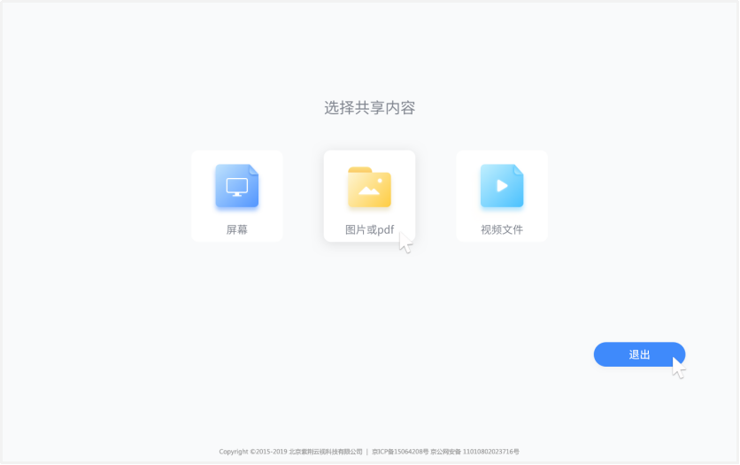
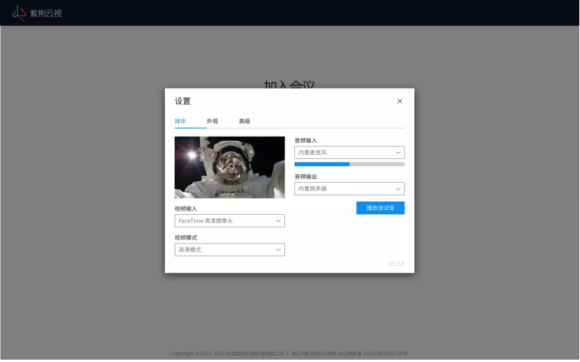
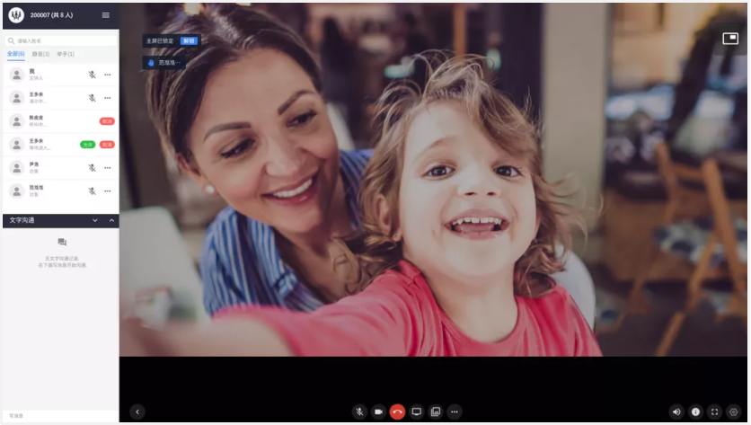

# web浏览器快速体验手册

## 1.web浏览器入会

在入会之前，我们已经通过管理员分配、APP注册或者官网自注册拿到了会议室资源：包括会议室号码和会议室密码。

1.安装好插件后在Chrome浏览器地址栏中输入：http://www.zijingcloud.com/  访问到紫金云官网的首页，点击加入会议入会，或者直接在地址栏中输入：https://cs.zijingcloud.com/web_join/  在加入会议页面进行入会，如图所示

### 1.加入会议

（1）输入会议号码

（2）输入会中显示的名字

（3）点击视频会议或者音频会议入会

### 2.内容共享

（1）输入要投的终端显示的投屏码然后点击开始共享后连接终端

（2）或输入会议号进行会中共享，输入会议号后需要在下面的名称栏中输入要在会中显示的名称

（3）连接成功后选择合适的方式进行内容分享，可以支持屏幕、图片或PDF、视频文件

### 3.设置

在设置中我们可以对“摄像头”、“麦克风”、“音频输出”、呼叫“带宽”、界面“语言”等高级设置，进行设定。

## 2.会议中

在浏览器中加入会议后，入图所示：

（1）加入会议后可看到主屏画面跟小画面列表，主屏默认显示正在讲话的人，小画面列表，我本地画面永远默认置顶

（2）可双击小画面进行主屏锁定，再双击可取消也可通过解锁按钮取消锁定

（3）点击小画面列表的隐藏按钮收起小画面列表，再点击显示

### 1.会中支持如下功能：

（1）静音：开启/关闭本地麦克风

（2）静画：点击可开启/关闭语音模式。

（3）挂断：挂断会议

（4）桌面共享：共享电脑桌面

（5）共享文件：图片、视频文件

（6）更多： 在更多中可进行以下操作

布局切换：1大屏、4分屏、1+7

录制：开启录制后桌面吐司“录制连接成功”桌面显示录制小图标示意，关闭需二次弹框确认

直播：开启直播后桌面吐司“直播连接成功”桌面显示直播小图标示意，关闭需二次弹框确认

备注：

- 录制的文件在该地址下：https://z.zijingcloud.com/self/user/login登录账号进行查询和分享
- 直播建立后将https://cs.zijingcloud.com/live/{会议室号}分享给用户或者在浏览器打开进行观看直播

  

### 2.会控功能列表

点击菜单栏中最左侧箭头显示参会人列表通过参会人列表进行简单会控

（1）邀请：可通过通讯录邀请和其他方式进行邀请

（2）全体静音：静音当前访客跟后续入会访客

（3）锁定会议：锁定会以后，后续参会人入会时，需要等待主持人允许才能入会

（4）全体手放下：当参会人被静音时，可举手发言，多个人举手可使用“全体手放下”

（5）结束会议：结束当前会议

（6）还可对都当前参会人进行以下操作

- 静音：静音当前参会人；可解除静音，当参会人举手的时候可允许发言
- 改名：修改参会人的名称
- 手放下：若当前参会人正在举手可将手放下
- 移除：可将该参会人移除该会议
- 设为主持人：可将该参会人的访客身份切换成主持人身份

