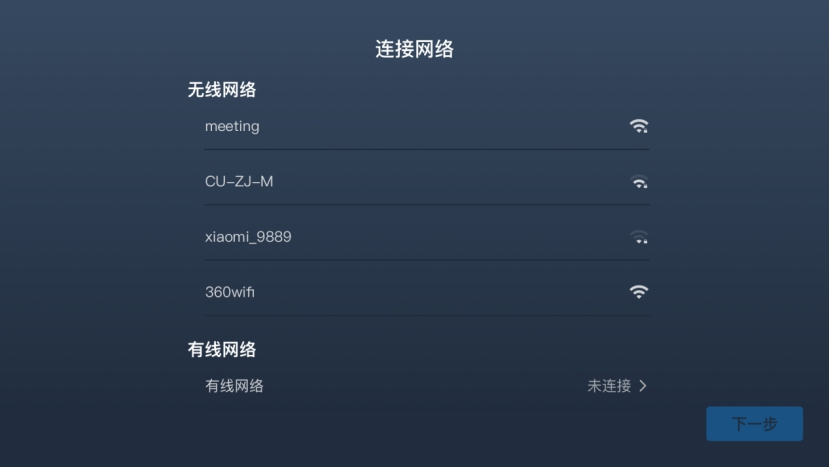

# 桌面一体终端快速体验手册

**1.配置网络**

 

终端首次开机后需要先配置网络，可以选择连接无线网络或者插入有线网络。成功连接网络后即可点击“下一步”。

 

**2.登录或注册**

 

​	若您是老客户，您可通过已有用户/终端账号，或者通过企业管理平台为此终端创建新用户/终端账号，然后在此终端登录。

​	若您是新客户，尚未拥有企业账号，可直接点击页面中的“去注册”，输入手机号等信息即可完成企业注册。如下图。(也可访问[www.zijingcloud.com](http://www.zijingcloud.com)官网进行注册并创建账号)

 **3.加入会议**

​	新客户注册成功后，默认会分配一个50方的体验云会议室（注：单次会议室时长限30分钟）。

您可按照页面指引快速进入云会议室：

（1）点击拨号（可在该页面跳过指引，跳过后则不再显示后续指引步骤）

（2）点击体验会议室，使用体验会议室进行入会

 

 

**4.分享邀请他人入会**

​	入会后可根据指引点击此处查看会议信息并通过扫码二维码分享会议邀请

 

 

 

**5.会议分享链接快速入会**

被邀请人点击会议分享链接，按照页面指引加入会议，或者下载应用后加入会议。   

​     

 

