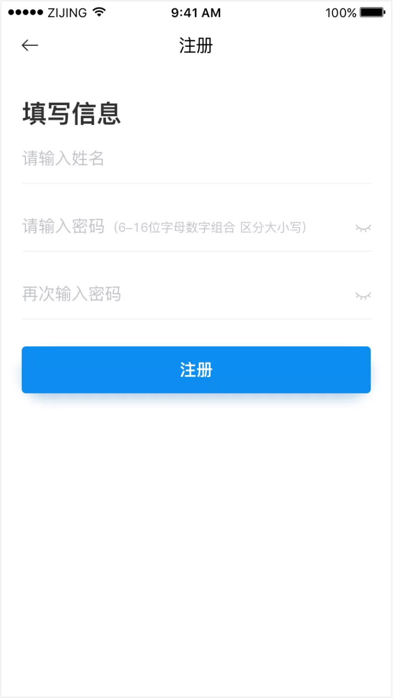

# 紫荆云 APP使用手册

## 1 登录紫荆云APP

1. 通过以下方式下载紫荆云 App：

- 从苹果或安卓的应用商店，搜索“紫荆云ZijingCloud”，免费下载紫荆云 App。 
- 访问紫荆云官网下载中心（  http://www.zijingcloud.com/download.html  ）， 用手机扫描下载二维码，自动跳转至下载页面。 

2. 下载安装成功后，点击紫荆云图标，打开登录界面，如图所示。

   

   （1）加入会议：点击加入会议按钮，用户可以无需注册登录，直接输入会议号和入会名称，加入指定视频会议。

   

   （2）登录： 输入用户名/账号和密码进行登录

   

   （3）注册：输入手机号输入验证码点击下一步

   

   填写姓名后输入密码后点击注册，注册后自动登录后会获得免费的体验会议室资源。

   

   

   （4）设置：可在设置中进行内容共享或者进行清晰度设置

## 2 主界面介绍

用户成功登录后进入APP主界面

主界面功能说明如下：

1.会议功能区域

提供四个会议功能入口，包括加入会议、发起会议、内容共享、主持会议。

2.历史记录区域

显示了用户最近呼叫过的云会议与终端号码列表，点击列表中的某一条记录，可对该号码发起呼叫。左滑可进行删除

默认将个人会议室的呼叫记录置顶

3.系统功能导航区域

提供四个功能入口，包括会议、通讯录、日程和个人设置（我）。

## 3 会议管理

### 3.1加入会议

#### 3.1.1在主界面输入会议号加入会议

1.在紫荆云 App 的主界面，点击加入会议按钮，打开加入会议界面，如 图 所示。

2.输入云会议号点击加入会议按钮入会。或直接点击下方的历史通话记录直接发起视频呼叫。

3.（可选）选择是否开启入会时静音

4.（可选）选中一条通话历史记录，并向左滑动，可删除此条记录。

#### 3.1.2通过微信分享的卡片加入会议

当其他参会者通过微信收到入会邀请卡片，点击卡片打开会议邀请界面， 如图所示。

1.在微信中打开小程序卡片

2.点击APP入会或者是微信入会

3.或者其他方式入会：

-  电脑浏览器入会

     在Chrome浏览器中访问：https://cs.zijingcloud.com/web_join/ 加入会议

- 硬件终端入会

    拨打会议室号码如：2019  输入密码：8888

    (备注：未注册SIP终端请呼叫：2019@sip.myvmr.cn)

- 电话语音入会

​       呼叫：01053806398

​       按语音提示依次输入：2019#8888

#### 3.1.3通其他分享链接入会

其他分享链接有：短信链接、钉钉企业微信等，可通过这些链接调起APP直接入会

### 3.2发起会议

1.在紫荆云 App 的主界面，点击发起会议按钮，打开发起会议界面，如图所示。

2.也可将会议通过微信、短信、复制链接、钉钉、企业微信的方式分享给其他参会者。

（备注：默认发起会议使用自己的私人会议室，若没有私人会议室则无法发起会议。）

3.可在我（个人信息）→我的云会议中查看会议室详情并查看或修改会议室密码。如图

  修改会议室密码

### 3.3内容共享

内容共享是通过输入投屏码的方式与紫荆云的其他硬终端建立连接后进行无线投屏。

1.在主界面点击内容共享界面后输入投屏码

2.选择内容共享的方式，主要有三种共享方式：屏幕、照片、文件（仅限图片和PDF文件）

### 3.4主持会议

在主界面点击主持会议，输入“会议号”跟主持密码即可进入主持会议界面，如下图

1.输入会议号及主持密码点击主持会议按钮

2.主持会议界面

主持会议功能列表

（1）邀请参会人入会

（2）对现有的参会人的控制：静音/允许发言/手放下、改名、手放下、移除、设为主持人等。

（3）开启/关闭录制功能

（4）全体静音/解除全体静音

（5）更多：视频布局、全部停止举手、锁定会议、结束会议等操作

## 4 会议中的操作

用户使用 App 加入会议后，视频通话中界面如图所示。

1.会中支持如下功能：

（1）静音：开启/关闭本地麦克风

（2）静画：点击可开启/关闭语音模式。

（3）切换摄像头：点击可在前置和后置摄像头间切

（4）内容共享：图片、屏幕文件

（5）参会人的操作：

- 静音：静音当前参会人；可解除静音，当参会人举手的时候可允许发言
- 改名：修改参会人的名称
- 手放下：若当前参会人正在举手可将手放下
- 移除：可将该参会人移除该会议
- 设为主持人：可将该参会人的访客身份切换成主持人身份

（6）更多：点击可选择布局、录制、直播操作

（7）挂断：退出当前会议

2.会中简单会控

（1）点击参会人图标

（2）进入参会人列表页进行简单会控如图

会控功能列表

- 邀请：可通过微信、短信、复制链接、通讯录、钉钉、企业微信等方式邀请

- 全体静音：静音当前访客跟后续入会访客

- 锁定会议：锁定会以后，后续参会人入会时，需要等待主持人允许才能入会

- 全体手放下：当参会人被静音时，可举手发言，多个人举手可使用“全体手放下”

- 结束会议：结束当前会议

## 5 通讯录管理

在底部功能导航栏上，点击通讯录标签按钮，即显示通讯录页面，如下图

1.可使用个人会议室发起多人组会

（1）进入终端/用户的详情页点击视频通话按钮

（2）进入通讯录列表选择参会人后点击“确定按钮”如图

（3）进入立即参会页面点击"立即开会按钮"

备注：点击“—”号可进行删除已选择的参会人

## 6 日程管理

在底部功能导航栏上，点击日程标签按钮，即显示日程页面如下图

日程界面包含我的会议和我的直播，可切换查看

1.点击任一一条会议/直播进入会议/直播详情如图，

（1）点击分享按钮，分享会议/直播给其他参会人

（2）点击更多按钮，编辑或者取消预约的会议和直播

（3）点击加入会议/直播按钮，进入会议/直播

2.点击“+”号可创建直播和预约会议

（1）创建直播：

按页面提示填写直播主题、播简介、选择开始时间、直播时长、观看限制（观看限制分为三种：密码、付费和无限制。选择密码则设置观看密码；选择付费则设置付费金额）

提交成功后可立即分享直播链接，如下图。也可在“日程”里查看、分享。

（2）预约会议

预约会议与创建直播流程一致，页面信息略有不同，预约会议必须填写会议的主持密码，且主持密码与参会密码不能一致。

## 7 个人设置

在底部功能导航栏上，点击“我”标签按钮，进入个人信息界面，该界面包括个人信息、我的会议室、录制空间、设置、关于，如下图：

1.个人信息：页面上方显示了头像用户名和账号，点击右侧箭头，进入个人信息详情页进行查看，并可以修改登录密码。点击“退出登录”按钮即可退出APP，返回至未登录主界面。

2.我的会议室：点击我的云会议室，可查看我的会议室

3.设置：点击设置，可选择视频清晰度。默认高清模式。

4.关于：在关于界面。系统支持查看版本信息、检查版本升级和收集反馈意见

