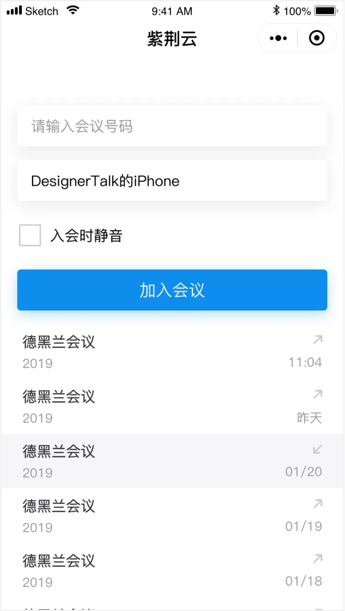
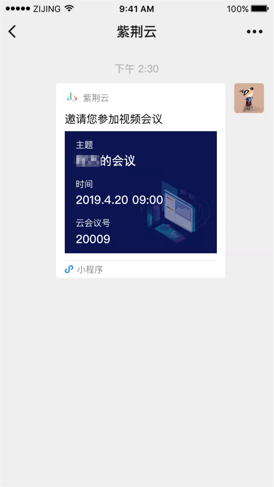

# 紫荆云小程序使用手册

紫荆云视频会议除web浏览器，APP（iOS和Android），PC端及其他硬终端外还支持小程序协同入会

## 1.打开小程序的方式

（1）方式一：在微信→发现→小程序，在小程序中搜索紫荆云ZIjingCloud小程序打开

（2）方式二：扫码体验

（3）打开小程序

## 2.入会

（1）方式一：打开小程序后，输入会议号和姓名入会

（2）方式二：直接通过历史记录入会（初次使用小程序没有历史会议记录）

（3）方式三：通过其他参会人微信分享的小卡片入会

​      首先在微信中打开小程序卡片如图：

其次点击微信入会

## 3.会中

入会后小程序会中画面如下：标题栏、视频区、操作栏

标题栏：入会后的会议时长、会议室号

视频区：主屏显示正在说话的人，右上角显示自己，其他参会人显示在主屏下方

菜单栏：功能列表

- 静音：关闭/打开麦克风
- 静画：关闭/打开摄像头
- 切换摄像头：切换前置/后置摄像头
- 挂断：挂断会议

