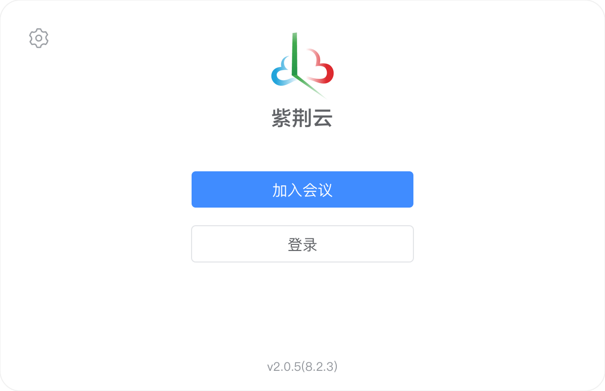
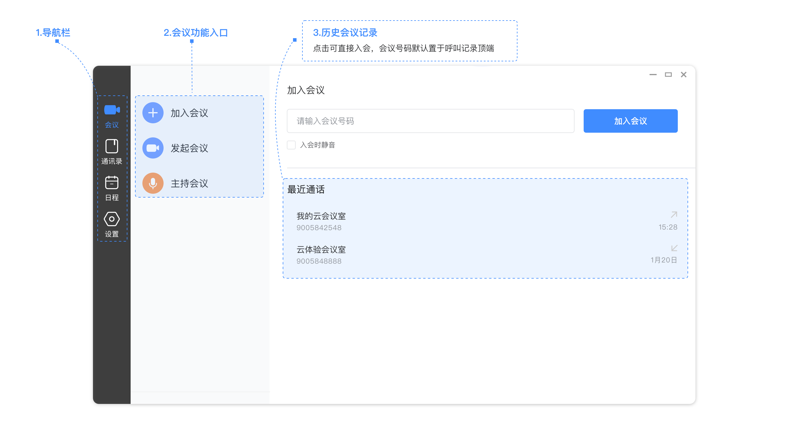
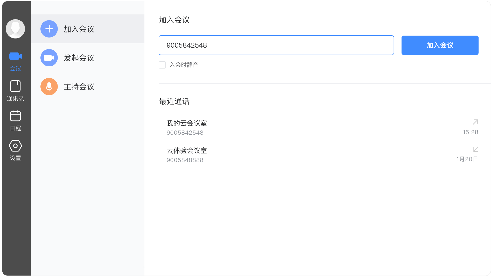
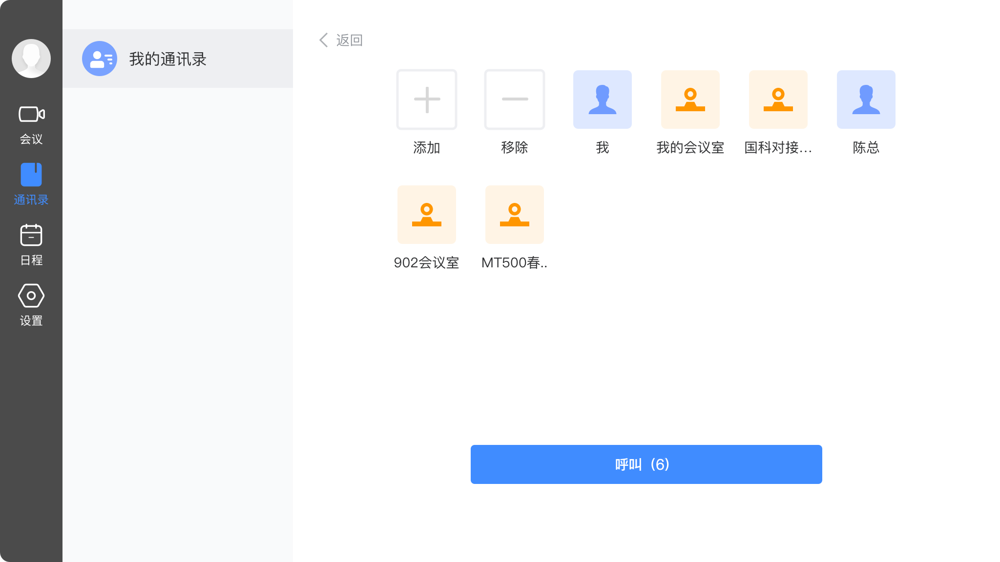
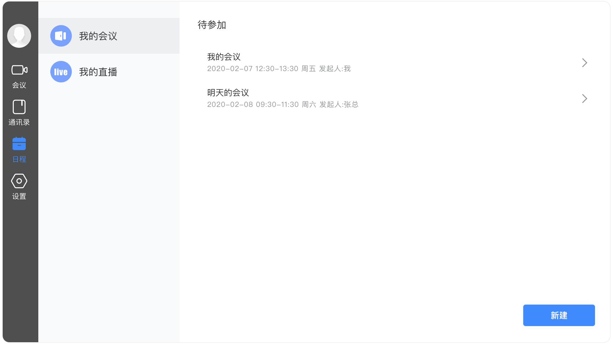
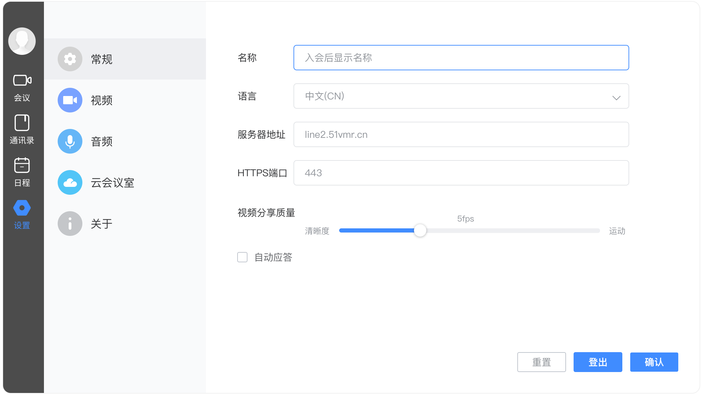
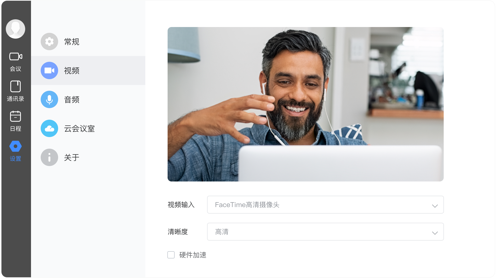
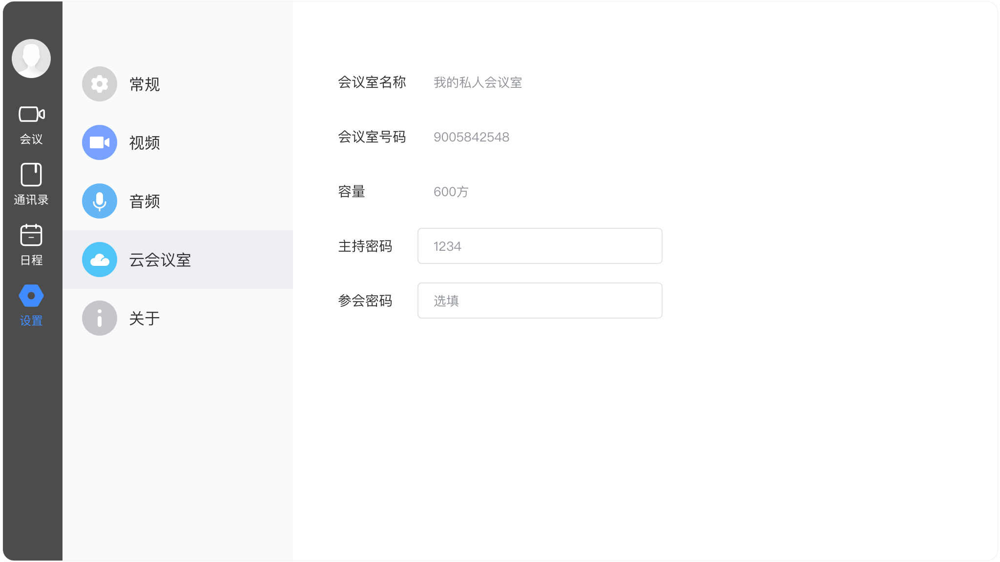

# 紫荆云视电脑客户端使用手册

## 1 登录/注册紫荆云视电脑客户端

1.紫荆云官网下载最新版本的紫荆云视电脑客户端软件。链接如下：https://www.zijingcloud.com/#/download

2.下载安装包后，双击开始安装。安装时选择的语言就是第一次启动时的默认语言。

3.安装完毕后，点击紫荆云视电脑客户端应用图标启动应用，打开账号登录界面，点击登录，**如图1所示**。

图1：账号登录界面

4.登录紫荆云视电脑客户端。

​    如果用户已经注册过紫荆云账号（例如用户已在紫荆云APP 完成注册），可通过以下两种方式登录。

​    ➢ 在账号密码登录界面，输入注册的账号、密码，点击登录按钮 登录电脑客户端。

   若用户尚未注册紫荆云账号，请先点击注册按钮完成注册，注册完可自动/手动登录。

5.点击加入会议按钮，用户可以无需注册登录，直接输入会议号或终端号，设置入会显示的名称。输入密码进入会议.

6.点击登录窗口的“设置”，查看应用详情、设置服务器地址，如**图**2所示。

## 2 主界面介绍

用户登录成功后，显示的紫荆云视电脑客户端的主界面**如图3所示**

图3主界面

主页面的区域功能说明如下：

1.导航栏：会议、通讯录、日程、设置

2.会议功能入口：加入会议、发起会议、主持会议

3.历史会议记录:   可通过历史通话记录快速入会

## 3会议管理

### 3.1 加入会议

选择菜单[会议→加入会议]，输入云会议号或者终端号码，点击加入会议按钮，发起视频呼叫。**如图4所示：**

用户可根据实际需要，勾选**入会时静音**复选框。

### 3.2 发起会议

选择菜单【**会议**→**发起会议→开始会议**】，进入个人云会议室**点击开始会议，如图5所示**

用户可通过以复制链接的方式邀请其他参会者进入云会议室开始会议：

### 3.3 会议中的功能

用户成功加入视频会议后，可在会议中点击视频窗口下方的工具栏按钮，选择会议中的操作。**如图6所示**：

小画面列表操作：用户还可根据需要在视频栏右侧的小窗口列表进行：隐藏  显示 仅显示一个等对小窗口进行操作。

锁定主屏：用户可对某一小画面进行双击锁定至主屏，并在主屏上通过**解锁**按钮进行解锁操作。

 ⚫ 静音：关闭或开启本地麦克风。 

 ⚫ 打开/关闭摄像头：关闭或开启本地视频摄像头。

 ⚫ 内容共享：点击开始发起内容共享，包括分享的屏幕、应用、视频、图片等。 

 ⚫ 邀请：通过复制链接邀请参会人入会。

 ⚫ 参会人：进入参会人列表进行简单会控。

  会中进行简单会控：

（1）点击参会人图标

（2）进入参会人列表页进行简单会控**如图7所示**

会控功能列表

   ➢ 邀请：可通过复制链接、通讯录等方式邀请

   ➢ 全体静音：静音当前访客跟后续入会访客

   ➢ 锁定会议：锁定会以后，后续参会人入会时，需要等待主持人允许才能入会

   ➢ 全体手放下：当参会人被静音时，可举手发言，多个人举手可使用“全体手放下”

   ➢ 结束会议：结束当前会议

 ⚫ 聊天：在会中跟参会人进行文字聊天。

 ⚫ 录制：开始或停止录制当前会议。

 ⚫ 表情：发送表情调节会议气氛。

 ⚫ 更多：

​           直播：中开始或停止直播当前会议。

​           设置：视频输入、音频输入、音频输出的设置。      

 ⚫ 挂断：结束本次呼叫，并退出当前会议。 

 ⚫ 全屏：关闭或开启全屏显示视频窗口。 

 ### 3.4主持会议

选择菜单【**会议**→**发起会议→主持会议**】，输入会议号和密码进入主持会议页面。**如图8所示**

主持会议功能列表

（1）邀请参会人入会

（2）对现有的参会人的控制：静音/允许发言/手放下、改名、手放下、移除、设为主持人等。

（3）开启/关闭录制功能

（4）全体静音/解除全体静音

（5）更多：视频布局、全部停止举手、锁定会议、结束会议等操作

## 4 通讯录

在 紫荆云视电脑客户端的主界面，点击左侧导航栏上的通讯录按钮，打开通讯录界面。**如图9**

⚫ 视频通话：点击联系人可进行查看联系人详情或进行视频通话

⚫ 多人组会：账号有私人会议室，点击视频通话按钮选择其他参会人点击**[呼叫]()**。**如图10所示**

## 5 日程管理

选择菜单[日程→我的会议/我的直播]右侧显示已开始未结束的或未开始的预约会议/直播，**如图11**

## 5.1预约会议

选择菜单[日程→我的会议]在右下角选择**新建**。进行预约会议。**如图12**

### 5.2新建直播

选择菜单[日程→我的直播]在右下角选择**新建**。进行新建直播。**如图13**

## 6 设置

在主页面中，点击左侧导航栏上的设置按钮，打开客户端的系统设置界面， **如图14所示**

### 6.1常规

系统常规设置的界面如图 所示。用户可根据需要进行系统的常规设置， 包括入会名称修改、语言设置、服务器地址的查看、视频分享质量设置、端口号的查看、自动应答的开启/关闭、以及信息重置及账号的登出等。**如上图14**

### 6.2视频

在系统设置界面，点击视频按钮，打开视频界面。用户可以选择视频输入设备，并检测相应的设备，以及选择视频画面的清晰度。**如图15所示：**

### 6.3音频

在系统设置界面，点击音频按钮，打开音频界面。用户可以选择音频输入/输出设备，并检测相应的设备，**如图16所示：**

### 6.4云会议室

在系统设置界面，点击云会议室按钮，打开云会议室界面。用户可以查看会议室名称、会议室号码、会议室容量、并修改会议室的主持密码和参会密码，**如图17所示：**

### 6.4关于

在系统设置界面，点击关于按钮，用户可查看当前应用的版本号，并检查更新。**如图18所示：**

