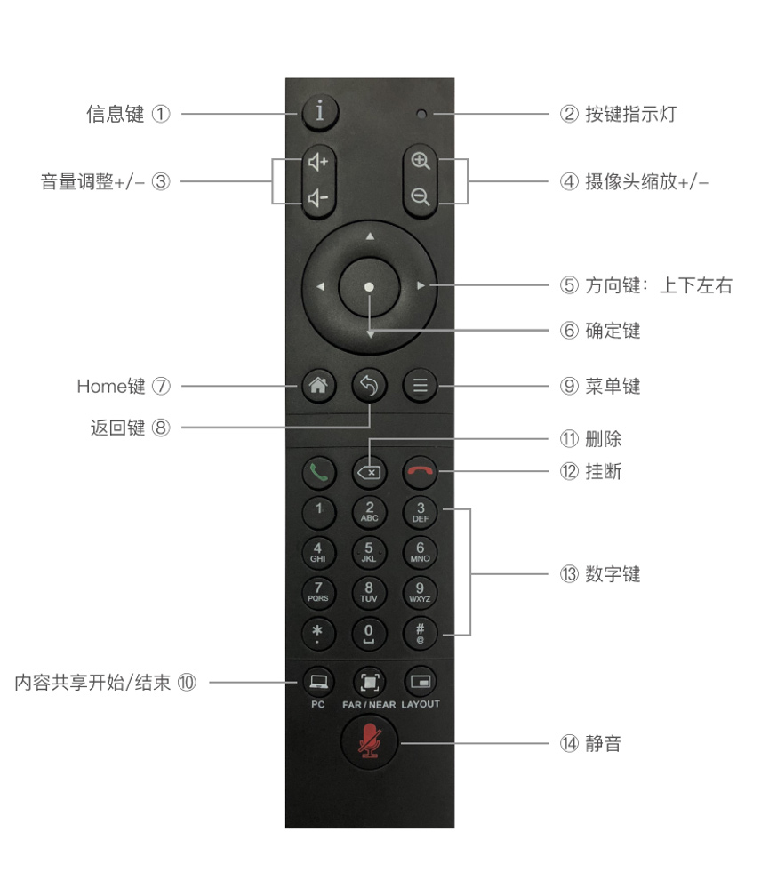
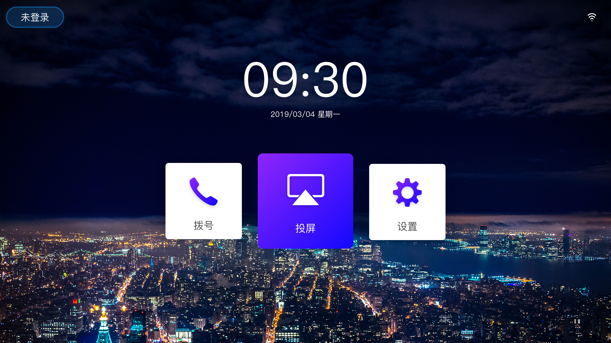
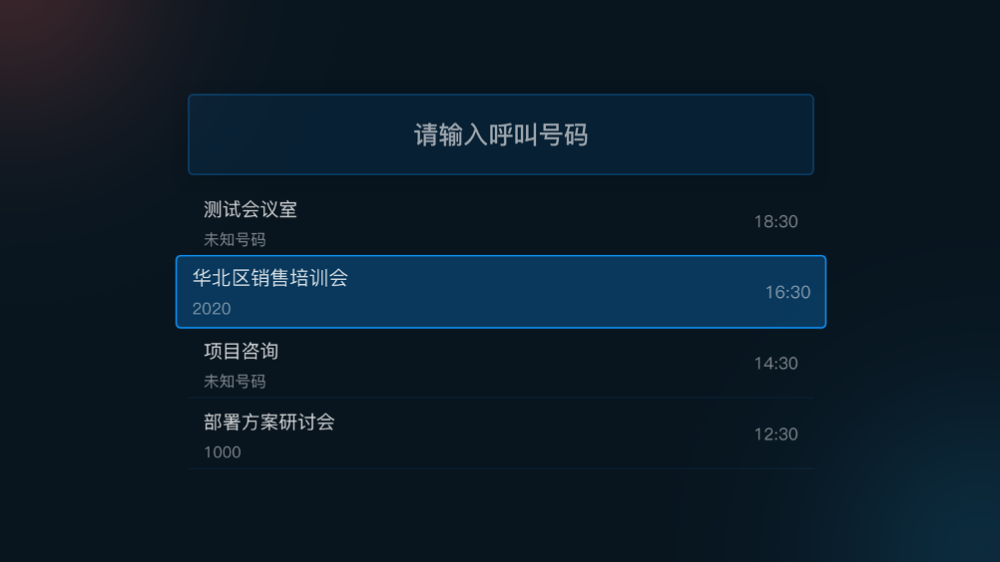
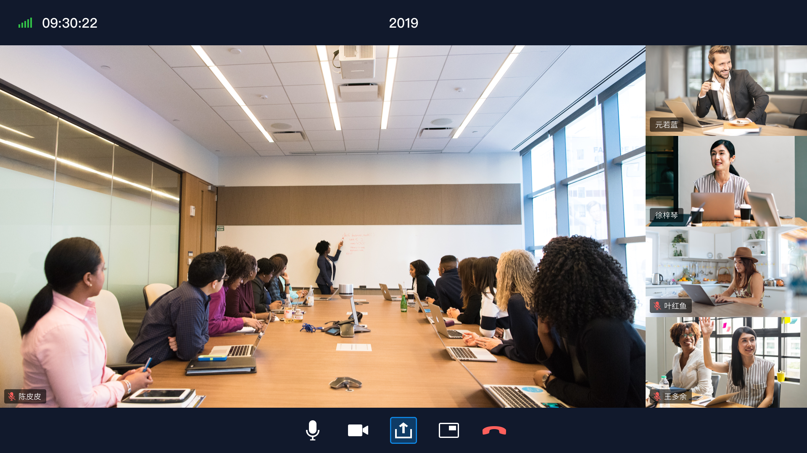
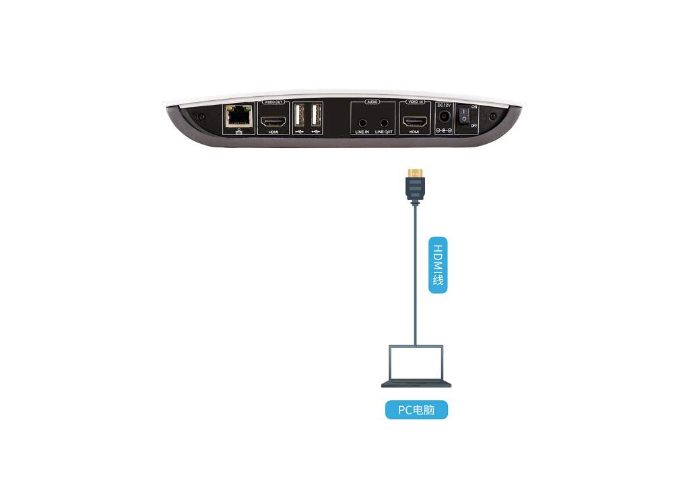

## MT260智能终端使用手册

### 一、安装与开关机

您可按如下步骤完成初次安装与开关机：

1、 检查硬件包装清单，确认包装完整、配件齐全。

2、 参照线缆连接图，完成各接口线缆连接。

3、 正确连接后，接通主机电源等待10秒左右，即可自动开机。

开机后，电视屏幕上将显示终端开机画面。（注：请将电视屏幕的信号源输入切换至HDMI输入模式）

### 二、遥控器

开机后，请使用遥控器进行功能操作。遥控器按键布局如下：

### 三、拨号与接听

开机后，主界面如下图所示：

屏幕左上角显示是否登录，登录后显示账户名及个人会议室号码。

选择并点击“拨号”后可进入呼叫界面用户可使用遥控器上的数字键，在屏幕输入框中输入所要呼叫的号码，按“呼叫”或“确定”键呼叫。

输入框下方为呼叫历史记录，可使用遥控器方向键，上下移动光标，选择其中某一条记录，按“确定”可拨打。

当有其他终端呼叫本终端时，屏幕上会显示下图的呼叫接入界面。用户可使用遥控器的“接听”或“挂断”键来接听或拒绝。(也可通过“左/右”键，选择“接听”或“挂断”，按“确定”键即可。)

### 四、通话中操作

进入通话状态后，用户可按遥控器上的按键，进行通话中的各种操作。

目前支持以下按键操作：

• 麦克风开始/关闭：通过遥控器上的“静音”键，或者通过遥控器选中屏幕菜单中的静音按钮可关闭或开启本地麦克风。

• 摄像头开启/关闭：关闭或开启本地摄像头。

• 云投屏：无需连接线缆，通过手机APP、电脑浏览器可直接将屏幕投放至终端显示器。

• 画面布局：切换视频画面布局。

• 挂断：结束本次通话。

• 本地摄像头调节：点击遥控器上的摄像头缩放+/-按键，可进入本地摄像头调节界面，如下图。此时，可通过遥控器上、下、左、右键对摄像头进行上下左右调节，以及通过缩放键控制画面的放大和缩小

### 五、内容共享

方式一：HDMI线连接HDMI IN和电脑

通过HDMI线连接电脑，点击遥控器的“内容共享开始/结束”按钮即可将电脑屏幕投放到终端显示设备上。再次点按遥控器“内容共享开始/结束”按钮可以结束内容共享。

方式二：云投屏

无需连接线缆，通过无线投屏方式将手机APP或电脑的屏幕、图片/PDF等投放至终端显示。

具体使用方式参见《紫荆云投屏使用手册》

### 六、设置

进入“设置”，可以对本终端各项设置进行修改。目前支持以下选项：

1、 通用：

• 终端名称：可修改终端名称。用户可以使用遥控器输入修改。

• 终端账号：选择点击终端账号可进入账号登录界面，登录后显示账号名及入网号码。

• 自动接听：自动后，若有来电呼叫终端将自动接听。

• 服务器地址：可通过服务器地址切换对接平台。

2、 网络：设置终端的网络连接。

• 有线网络：支持自动获取IP地址（IP地址、网关、子网掩码、DNS）和手动连接（静态IP设置）

• 无线网络：支持Wi-Fi网络连接

3、 媒体：设置音频、视频及清晰度。

• 音频：音频输入默认为内置麦克风，音频输出“默认”从HDMI-1和LineOut同时输出。

• 视频：视频输入默认为内置摄像头，视频输出使用遥控器左右按钮选择视频输出的接口。

• 清晰度：选择视频清晰度（流畅、高清、超高清）

4、 关于： 显示终端的软件版本、硬件版本、序列号、MAC地址。

• 软件版本：终端当前运行的软件版本号。

• 硬件版本：终端当前运行的硬件版本号。

• 序列号：终端的SN号。

• MAC地址：终端的Mac地址。

• 授权状态：显示终端当前的授权状态，若未授权，可点击进行手动检测授权。

• 检查更新：可点击手动检测软件/固件版本。