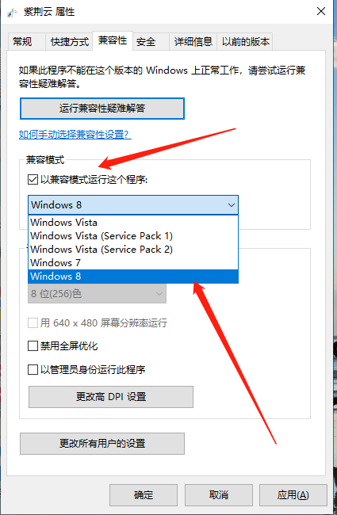
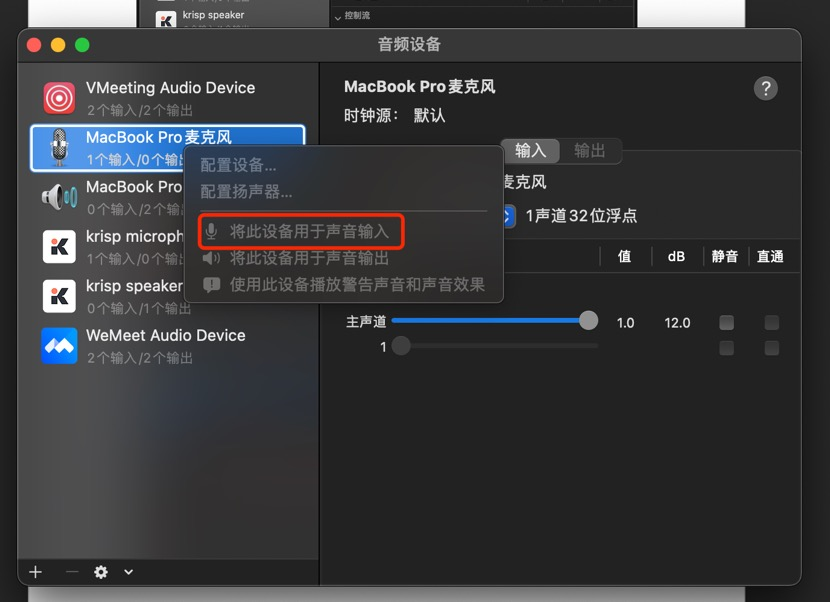
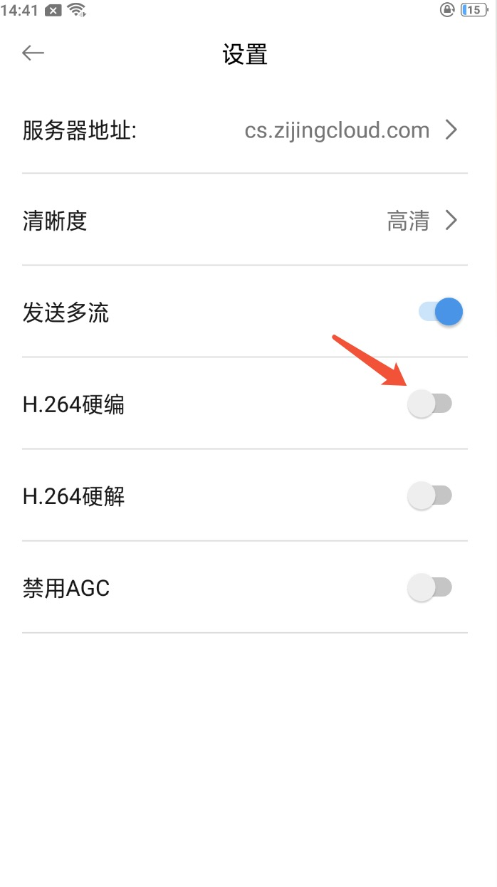

## 常见问题

 **1.为什么我的电脑无法安装或无法运行客户端**

A、PC客户端的安装要求

B：部分Windows 7操作系统，需要打开XP兼容模式运形。

C:   Windows系统vc2015异常也会导致这个问题出现，可点击下载新的vc2015进行更新：https://support.microsoft.com/en-us/topic/the-latest-supported-visual-c-downloads-2647da03-1eea-4433-9aff-95f26a218cc0

**2.为什么我的电脑客户安装时报.dll 文件错误，导致不能安装**

A、是由于Windows系统vc2015异常，导致无法安装，请点击链接重新下载vc20152015：https://support.microsoft.com/en-us/topic/the-latest-supported-visual-c-downloads-2647da03-1eea-4433-9aff-95f26a218cc0

**3.为什么我的笔记本客户端，界面响应慢同时图像声音卡**

A、检查笔记本是否电量不足；如若是，推荐接外置电源使用；

B、查看是否开启的进程太多，cup超负荷；如若是，请关闭其他进程，确保本应用可正常使用

**4.为什么在会中频繁掉出**

A、检查是否网络信号差；如若是，请更换网络（使用手机共享热点或更换其他wifi）

B、必要时可关闭视频，优先保障语音通话质量

**5.为什么我的Mac入会后，听不见声音或者说话其他端听不见**

A、mac接入耳机后，系统自动切换默认设置时，切换异常。

B、在启动台中打开MIDI音频设置，选中MacBook Pro扬声器选择将此设备用于音频输出，选中MacBook Pro麦克风选择将此设备用于声音输入。

**6.为什么我的Android APP在会中，发送大流失败，分辨率显示为0x0的问题**

A、如果是4.4.3以下的版本，可手动退会后在设置中关闭硬编，关闭硬编后APP将会重启。

